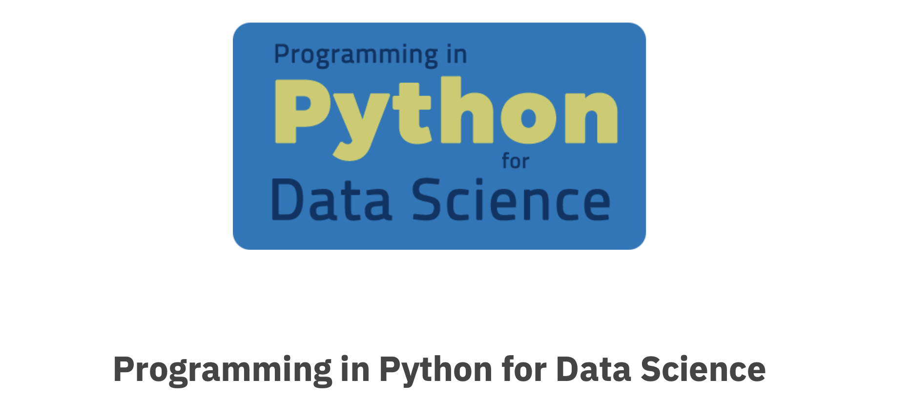

# Videos

```{tip} Note for Week 1
There are no videos assigned for the first week, but in general you will be assigned some videos before you attend the lecture. 
Below is a sample of what this will look like starting next week.
```

The videos are collapsible so once you're done with one, you can move to the next one.
In the sidebar on the right, you can use the checklists to keep track of what's done.

````{margin}
```{admonition} Checklist of items
:class: tip

<input type="checkbox" id="week01_video1" class="box"><label>Python I - Basic</input></label>

<input type="checkbox" id="week01_video2" class="box"><label>Python II - Basic </input></label>

<input type="checkbox" id="week01_video3" class="box"><label>Python I - Intermediate</input></label>

<input type="checkbox" id="week01_video4" class="box"><label>Python II - Intermediate</input></label>

```
````

## Required Videos - Beginner Track

```{dropdown} 1. Module 3, 4, 5
    :container: + shadow
    :title: bg-info text-white font-weight-bold
    :open:



[Lecture Notes](https://prog-learn.mds.ubc.ca/en)
```

You should complete Module 3,4,5 before next week.

## Required Videos - Intermediate or Advanced Track

```{dropdown} 1. Python III
    :container: + shadow
    :title: bg-info text-white font-weight-bold
    :open:

<div class="container youtube">
<iframe class="responsive-iframe" src="https://www.youtube-nocookie.com/embed/26YFLyMxXQ0" frameborder="0" allow="accelerometer; autoplay="0"; encrypted-media; gyroscope; picture-in-picture" allowfullscreen></iframe>
</div>

[Lecture Notes](https://firas.moosvi.com/courses/data301/notes/week05/python3.html)
```

```{dropdown} 2. Python IV
    :container: + shadow
    :title: bg-info text-white font-weight-bold
    :open:

<div class="container youtube">
<iframe class="responsive-iframe" src="https://www.youtube-nocookie.com/embed/J0s7mogIhQM" frameborder="0" allow="accelerometer; autoplay="0"; encrypted-media; gyroscope; picture-in-picture" allowfullscreen></iframe>
</div>

[Lecture Notes](https://firas.moosvi.com/courses/data301/notes/week05/python4.html)
```